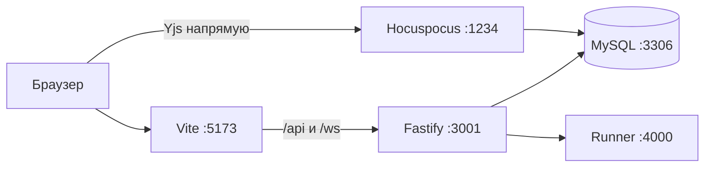

# Livepad

Self-hosted IDE для live-coding интервью: общая комната, несколько файлов, `npm install` и запуск Node.js. Интервьюер логинится, кандидат заходит по ссылке.

Репозиторий: [github.com/DamBalDoor/Livepad](https://github.com/DamBalDoor/Livepad).

Агенту: сначала [AGENTS.md](./AGENTS.md) и правила в [`.cursor/rules/`](./.cursor/rules/).

## Что уже есть

- Регистрация и вход интервьюера (email + пароль, cookie-сессия).
- Комната `/r/:slug?token=...`, гость вводит только отображаемое имя.
- Monaco, дерево файлов, курсоры в реальном времени (Yjs).
- Install / Run и общая консоль (stdout/stderr/exit).
- Панель «Кандидат» **только у хоста**: фокус вкладки, длина вставок (не текст), простой, мониторы. Кандидат видит предупреждение.

## Чего нет и не делать «заодно»

Пул заданий, таймер, автопроверка, чат, видео, LSP, интерактивный TTY, Google-логин, запись сессии, Piston. Это следующая платформа, не текущий MVP.

Не собирать сигналы скрытно. Не логировать текст буфера. Не подключать Piston, пока не появятся другие языки.

## Репозиторий

```
apps/web          Vite + React + Tailwind + Monaco
apps/api          Fastify: auth, комнаты, run WS, integrity WS; Hocuspocus на :1234
apps/runner       npm install + node (Docker или локальный fallback)
packages/shared   Общие TypeScript-типы
```

Один `Y.Doc` на комнату: `Y.Map("files")` → путь → `Y.Text`. Снимок в `rooms.yjs_state`. Гость в БД не хранится: пускаем по `invite_token`.



## Запуск

Нужны Node.js 20+ и pnpm (`corepack enable`). Docker Desktop желателен: MySQL и песочница Run. Без Docker MySQL поднимается скриптом, Run идёт локально с таймаутом.

```bash
cp .env.example .env
pnpm install
```

База:

```bash
pnpm db:up
# Windows без Docker:
pnpm db:up:local
```

Схема и процессы:

```bash
pnpm db:push
pnpm dev
```

| Что | URL |
| --- | --- |
| UI | http://localhost:5173 |
| API | http://localhost:3001 |
| Collab WS | ws://localhost:1234 |
| Runner | http://localhost:4000 |
| Health | http://localhost:3001/api/health |

Интервьюер: `/register` или `/login` → создать комнату → «Копировать ссылку». Кандидат открывает ссылку в другом браузере/инкогнито (иначе та же cookie сделает его хостом).

## Переменные

Корень репозитория, файл `.env` (в git не коммитить). Шаблон — `.env.example`. API читает именно корневой `.env`.

`BETTER_AUTH_URL` и `WEB_ORIGIN` должны совпадать с UI (`http://localhost:5173`). Секреты и пароли БД в README не дублируем.

## Как проверить, что живое

1. Залогиниться, создать комнату, открыть её.
2. Во второй вкладке **без сессии хоста** открыть invite-ссылку, ввести имя — код синхронизируется.
3. Run: в консоли есть stdout и код выхода.
4. Хост видит правую колонку «Кандидат»; гость её не видит, но видит предупреждение про фокус и вставки.

## Полезные команды

| Команда | Зачем |
| --- | --- |
| `pnpm dev` | web + api + runner |
| `pnpm db:push` | схема Drizzle → MySQL |
| `pnpm db:up` | MySQL в Docker |
| `pnpm db:up:local` | портативный MariaDB в `.tools/` (gitignored) |
