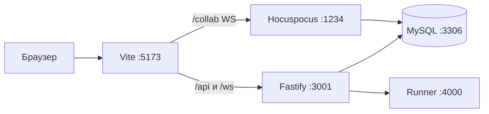

# Livepad

Self-hosted IDE для live-coding интервью: общая комната, несколько файлов, `npm install` и запуск Node.js. Интервьюер логинится, кандидат заходит по invite-ссылке с отображаемым именем (без аккаунта).

Репозиторий: [github.com/DamBalDoor/Livepad](https://github.com/DamBalDoor/Livepad).

Агенту: сначала [AGENTS.md](./AGENTS.md) и правила в [`.cursor/rules/`](./.cursor/rules/).

## Что уже есть

- **Auth:** регистрация и вход интервьюера (email + пароль, cookie-сессия better-auth).
- **Invite:** комната `/r/:slug?token=...`; гость вводит имя, проходит экран «Прозрачность сессии» (preflight + явное согласие), затем IDE.
- **Коллаб:** Monaco, дерево файлов (добавление/удаление), курсоры и текст в реальном времени (Yjs + Hocuspocus).
- **Run:** Install / Run / Stop (общие для хоста и гостя), общая консоль с очисткой (stdout/stderr, код выхода).
- **Статусы:** отдельные чипы **Collab** (редактор) и **Runner** (песочница) в шапке комнаты.
- **Целостность (host-only):** правая колонка «Кандидат» только у интервьюера; гость видит баннер и список сигналов при входе. Собираем фокус вкладки, объём крупных вставок (**не текст** буфера), бездействие, окно/мониторы и др. — без скрытого прокторинга.
- **Комната:** «Копировать ссылку», **новая ссылка** (rotate invite), **завершить комнату** (read-only для хоста, доступ закрыт для гостя) — в IDE и на дашборде.
- **host_cookie:** если интервьюер открывает invite-URL в том же браузере, UI предупреждает; для self-test гостя — **инкогнито** или другой профиль.
- **Тема:** оболочка по умолчанию **тёмная**; переключатель светлая/тёмная на дашборде и в комнате. Сохранение в `localStorage`, ключ **`livepad.theme`**. Monaco и панель консоли всегда на тёмном «холсте» (`--lp-editor-bg`, `--lp-console-bg`). Семантические токены интерфейса — CSS-переменные **`--lp-*`** в `apps/web/src/index.css`, утилиты Tailwind `lp-*`.

## Чего нет и не делать «заодно»

Пул заданий, таймер, автопроверка, чат, видео, LSP, интерактивный TTY, Google-логин, запись сессии, **Piston**. Скрытый прокторинг и логирование **текста** буфера обмена — запрещены. Это следующая платформа, не текущий MVP.

## Репозиторий

```
apps/web          Vite + React + Tailwind + Monaco
apps/api          Fastify: auth, комнаты, run WS, integrity WS; Hocuspocus на :1234
apps/runner       npm install + node (Docker или локальный fallback)
packages/shared   Общие TypeScript-типы
```

Один `Y.Doc` на комнату: `Y.Map("files")` → путь → `Y.Text`. Снимок в `rooms.yjs_state`. Гость в БД не хранится: пускаем по `invite_token`.



В `pnpm dev` Vite проксирует `/api`, `/ws` и **`/collab`** (→ `:1234`). В Docker DEV edge nginx делает то же на одном origin.

## Запуск

Нужны Node.js **20+** и pnpm (`corepack enable`). Docker Desktop желателен: MySQL и песочница Run. Без Docker MySQL поднимается скриптом, Run идёт локально с таймаутом.

```bash
cp .env.example .env
pnpm install
```

База:

```bash
pnpm db:up
# Windows без Docker:
pnpm db:up:local
```

Схема и процессы:

```bash
pnpm db:push
pnpm dev
```

| Что | URL / порт |
| --- | --- |
| UI | http://localhost:5173 |
| API | http://localhost:3001 |
| Collab (процесс Hocuspocus) | ws://localhost:1234 (браузер ходит на **/collab** через UI) |
| Runner | http://localhost:4000 |
| Health | http://localhost:3001/api/health |

Интервьюер: `/register` или `/login` → создать комнату → «Копировать ссылку». Кандидат открывает ссылку в **другом браузере или инкогнито** (иначе cookie интервьюера может помешать гостевому сценарию).

## CI/CD и prod (черновик)

Docker-стек DEV, GitHub Actions и выкладка на сервер **в процессе**; детали compose, edge и Actions — в [deploy/README.md](./deploy/README.md) и в [PR #3](https://github.com/DamBalDoor/Livepad/pull/3). Актуальные хосты, секреты и runbook дополняет DevOps; в этом README их не фиксируем.

Локальный `docker-compose.yml` (MySQL + runner для `pnpm dev`) и команды `pnpm docker:dev:up` / `pnpm db:push:docker` — для полного стека в контейнерах, когда окружение настроено.

## Переменные

Корень репозитория, файл `.env` (в git не коммитить). Шаблон — `.env.example`. API читает именно корневой `.env`.

`BETTER_AUTH_URL` и `WEB_ORIGIN` должны совпадать с origin UI (локально `http://localhost:5173`). Секреты и пароли БД в README не дублируем.

## Как проверить, что живое

1. Залогиниться, создать комнату, открыть её.
2. Во **второй сессии без cookie хоста** (инкогнито) открыть invite-ссылку → preflight → имя → код синхронизируется; чип Collab — «Синхронизировано».
3. Install / Run: в консоли stdout и код выхода; Stop прерывает выполнение; «Очистить» сбрасывает вывод локально в UI.
4. Хост видит колонку «Кандидат» и чип Runner; гость колонку не видит, но видит баннер про сигналы сессии.
5. Переключить тему — оболочка меняется, редактор остаётся тёмным.

## Полезные команды

| Команда | Зачем |
| --- | --- |
| `pnpm dev` | web + api + runner |
| `pnpm db:push` | схема Drizzle → MySQL |
| `pnpm db:up` | MySQL в Docker |
| `pnpm db:up:local` | портативный MariaDB в `.tools/` (gitignored) |
| `pnpm docker:dev:up` | полный DEV-стек в Docker (см. deploy/) |
| `pnpm db:push:docker` | drizzle push в контейнере migrate |
